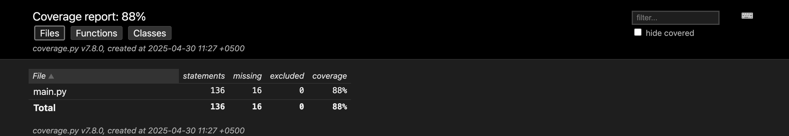

# Chat Room Application

A simple chat room application that allows users to create, edit, and delete chat rooms using HTMX with a Flask backend for seamless user experience without full page reloads.

## Live Demo

Check out the live demo at: [https://chat-room.rehanqasim.com](https://chat-room.rehanqasim.com)

## Overview

This application demonstrates the use of HTMX to create a seamless user experience with a single-page-like application without using a complex frontend framework. The application allows users to:

- Create new chat rooms with unique names
- Edit the names of their own chat rooms
- Delete their own chat rooms
- View a list of available chat rooms
- Join and leave chat rooms

## Technologies Used

- **HTML5**: For the page structure
- **CSS3**: For styling the application
- **JavaScript**: For client-side logic
- **HTMX**: For handling AJAX requests without full page reloads
- **Hyperscript**: For additional interactive behaviors
- **Flask**: Python web framework providing the backend API
- **Flask-CORS**: For enabling cross-origin resource sharing

## Project Structure

```
chat-room/
├── main.py              # Flask server implementation
├── requirements.txt     # Python dependencies
├── pytest.ini          # Pytest configuration
├── data/
│   ├── joined_rooms.json   # Data persistence for joined rooms
│   └── rooms.json          # Data persistence for chat rooms
├── server/             # Server-related files
├── static/
│   ├── index.html      # Main HTML file
│   ├── css/
│   │   └── styles.css  # Styling for the application
│   ├── img/
│   │   └── favicon.svg # Application icon
│   └── js/
│       └── app.js      # Client-side application logic
├── tests/              # Test files
│   ├── conftest.py     # Pytest fixtures and configuration
│   ├── test_data_persistence.py  # Tests for data persistence
│   ├── test_room_api.py          # Tests for room API
│   └── test_room_membership.py   # Tests for room membership
├── coverage/           # Coverage reports
│   └── test_coverage.png # Test coverage screenshot
└── README.md           # This documentation file
```

## Setup and Installation

1. Clone the repository:
   ```
   git clone <repository-url>
   cd chat-room
   ```

2. Install the required Python dependencies:
   ```
   pip install -r requirements.txt
   ```

3. Run the Flask server:
   ```
   python main.py
   ```

4. Open your browser and navigate to:
   ```
   http://localhost:5000
   ```

## How to Use the Application

### User Identification

- When you first load the application, you'll be assigned a default username ("User1").
- You can change your username by editing the "Logged in as:" input field.
- Your username determines which chat rooms you own and can therefore edit or delete.

### Creating a Chat Room

1. Click the "Create Room" button at the top of the page.
2. Enter a name for your chat room in the form that appears.
3. Click "Create Room" to add it to the list.

### Editing a Chat Room

1. For rooms that you own (created by your current username), an "Edit" button will be visible.
2. Click "Edit" to open the edit form.
3. Change the room name in the form.
4. Click "Update Room" to save your changes, or "Cancel" to discard them.

### Deleting a Chat Room

1. For rooms that you own, a "Delete" button will be visible.
2. Click "Delete" to remove the room.
3. Confirm the deletion when prompted.

### Joining and Leaving a Chat Room

1. Click the "Join" button on any room to join the room.
2. Once joined, the button changes to "Leave".
3. Click "Leave" to exit a room you've joined.

## Testing and Code Coverage

The application includes a comprehensive test suite that validates core functionality. The tests are implemented using pytest and cover:

1. **Room API Tests**: Verifies CRUD operations for chat rooms
2. **Room Membership Tests**: Validates joining and leaving chat rooms
3. **Data Persistence Tests**: Tests loading and saving of room data and joining status

### Test Coverage

The current test suite achieves 88% code coverage of the main application file:



- **Total Lines of Code**: 136
- **Lines Covered**: 120
- **Lines Not Covered**: 16
- **Coverage Percentage**: 88%

The not covered lines are primarily in error handling paths that are less likely to be executed in normal operations.

### Running Tests

To run the tests and generate a coverage report:

```
pip install -r requirements.txt  # Ensure test dependencies are installed
pytest  # Run tests with coverage reporting
```

The HTML coverage report is generated in the `htmlcov` directory. Open `htmlcov/index.html` in a browser to view detailed coverage information.

## Design Decisions and Assumptions

### Backend Implementation

- The application uses Flask as a lightweight backend server.
- Data is persisted in JSON files in the data directory.
- Pre-populated with sample data when first run.

### HTMX Integration

- HTMX is used to handle all AJAX operations, providing a seamless user experience without page reloads.
- The application leverages HTMX attributes such as:
  - `hx-get`, `hx-post`, `hx-put`, `hx-delete`: For handling different HTTP methods
  - `hx-target`: For specifying where the response should be inserted
  - `hx-swap`: For controlling how the response is inserted
  - `hx-trigger`: For defining what event triggers the request

### User Ownership

- Room ownership is determined by the username of the creator.
- Only the creator of a room (based on the current username) can edit or delete it.
- This is a simplification for the demo - in a real application, proper authentication would be used.

### User Interface

- The UI is designed to be simple and intuitive.
- Form validation ensures that room names cannot be empty.

## Future Enhancements

- Implement actual chat functionality within rooms
- Add user authentication and persistent user accounts
- Implement real-time updates using WebSockets
- Add search functionality for rooms
- Add user profile customization
- Deploy with a production-grade WSGI server like Gunicorn


